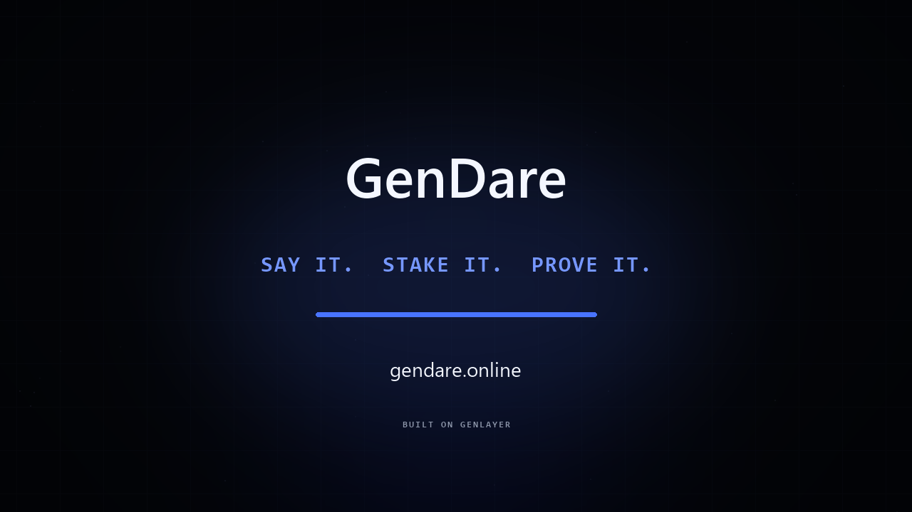
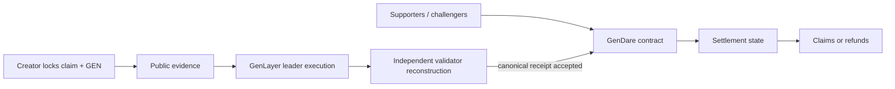

# GenDare

> Stake the claim. Prove the outcome.



GenDare is a public accountability market on GenLayer. A creator defines an exact outcome, locks GEN behind it, and invites others to support or challenge the claim. When the deadline passes, GenLayer validators inspect the locked public evidence and produce a receipt that the contract can settle on-chain.

[Open GenDare](https://gendare.online) · [View the contract](https://explorer-studio-dev.genlayer.com/address/0x86aC73EaDe7563B2c67a9bfD06E6D59AE0CA3980) · [Deployment transaction](https://explorer-studio-dev.genlayer.com/tx/0x094c31fa424ddb87d5d964e8690226bdbef25c7a2af45060d02629b258f9bed1)

## The problem

Most accountability apps stop at a promise, and ordinary smart contracts can only settle facts already expressed in machine-readable data. Real commitments are harder: proof may be a release page, a public profile, a repository, or another web source whose meaning must be interpreted.

GenDare makes that boundary explicit:

1. deterministic contract logic locks the claim, deadline, evidence requirements, participants, and funds;
2. GenLayer validators independently reconstruct the result from the same public source;
3. only a consensus-approved receipt changes settlement state;
4. winners claim from the contract, while infrastructure failures follow bounded retry and explicit fallback paths.

## Two settlement modes

| Dare           | Creator locks                                                                                         | Validators establish                                                                                        | Result                                                    |
| -------------- | ----------------------------------------------------------------------------------------------------- | ----------------------------------------------------------------------------------------------------------- | --------------------------------------------------------- |
| **Goal dare**  | Goal, claimant identity, objective criteria, deadline, evidence hint, category, visibility, and stake | Whether the locked public source proves the criteria for the identified claimant within the required period | `COMPLETE`, `INCOMPLETE`, `INCONCLUSIVE`, or `UNREADABLE` |
| **Price dare** | Coin identifier, target in integer micro-USD, condition, deadline, visibility, and stake              | The qualifying CoinGecko samples in the exact on-chain window                                               | `COMPLETE`, `INCOMPLETE`, `INCONCLUSIVE`, or `UNREADABLE` |

Price dares support two conditions: at or above the target near the deadline, or reaching the target at any point before the deadline. Goal dares require the creator to lock a readable public HTTPS source before the deadline. The contract records its digest and byte length, then checks the same source again during resolution. In a contested goal dare the claimant bears the burden of proof: readable but insufficient, ambiguously attributed, or untimely evidence resolves `INCOMPLETE`; only infrastructure failures remain retryable.

## Why GenLayer

The difficult part is not holding a stake. It is turning public, natural-language evidence into one reproducible decision without trusting the creator, a centralized operator, or browser-side logic.

For goal dares, a leader evaluates the locked criteria and evidence while validators independently rebuild the full receipt and require canonical equality. For price dares, validators independently fetch and reduce the same bounded sample window. Deterministic code then applies state transitions, fees, refunds, and proportional claims. The frontend displays contract state; it does not invent verdicts.



## Contract guarantees

- Contract version `2.2.0`; receipt schema `gendare-receipt-v2`.
- Minimum position: `5 GEN`.
- Maximum dare duration: 90 days.
- Maximum 32 non-creator participants per side.
- A wallet cannot support and challenge the same dare; the creator's initial stake is on the support side.
- Goal evidence must be public HTTPS, readable when locked, and no larger than 24 KB.
- Price dares run for at least 10 minutes and open for settlement 10 minutes after the deadline.
- Infrastructure-only `INCONCLUSIVE` and `UNREADABLE` outcomes allow at most three resolution attempts, separated by a 30-minute cooldown. A contested goal that remains unverifiable then resolves `INCOMPLETE`; an uncontested goal or price dare becomes refundable.
- A 24-hour recovery path makes stakes refundable if consensus cannot produce a final receipt.
- A 2% protocol fee applies only to the losing pool of a contested final outcome, so a correct side never loses its own principal to fees. The contract owner can withdraw accrued fees. Uncontested and inconclusive settlements refund positions.
- Claim calculations are proportional to winning stake, with the final claim receiving any integer-division remainder.

Unlisted dares are still public on-chain. The visibility field is a discoverability preference for clients, not blockchain privacy.

## Deployed contract

| Field           | Value                                                                                                                                       |
| --------------- | ------------------------------------------------------------------------------------------------------------------------------------------- |
| Network         | GenLayer Studio Next                                                                                                                        |
| Chain ID        | `61997` (`0xf22d`)                                                                                                                          |
| RPC             | `https://studio-next.genlayer.com/api`                                                                                                      |
| Contract        | [`0x86aC73EaDe7563B2c67a9bfD06E6D59AE0CA3980`](https://explorer-studio-dev.genlayer.com/address/0x86aC73EaDe7563B2c67a9bfD06E6D59AE0CA3980) |
| Deployment      | [`0x094c31…f9bed1`](https://explorer-studio-dev.genlayer.com/tx/0x094c31fa424ddb87d5d964e8690226bdbef25c7a2af45060d02629b258f9bed1)         |
| Contract source | [`contracts/GenDareV2.py`](contracts/GenDareV2.py)                                                                                          |
| Source SHA-256  | `B30BDE8C571BFB67C63E8F44E7E956AD619CD8D34EA94C93299B7B2232E6DE91` (canonical LF)                                                           |

## Run locally

The application uses React, TypeScript, TanStack Start, Vite, `genlayer-js`, and an injected EVM wallet such as Rabby or MetaMask.

```bash
git clone https://github.com/zakazaka95/GenDare.git
cd GenDare
npm ci
npm run dev
```

Before sending a transaction, add or switch the wallet to Studio Next:

```text
Network:  GenLayer Studio Next
RPC:      https://studio-next.genlayer.com/api
Chain ID: 61997
Symbol:   GEN
Explorer: https://explorer-studio-dev.genlayer.com
```

Production checks:

```bash
npm run typecheck
npm run lint
npm run build
```

No environment variable is required for the current deployment. The shared Studio Next network definition lives in `src/lib/network.ts`, wallet switching lives in `src/lib/injected.ts`, and the deployed address lives in `src/lib/contract.ts`.

## Contract tests

The repository includes 30 deterministic unit tests for creation rules, evidence locking, prompt-boundary hardening, full-receipt validation, price-window reduction, adversarial participation, skewed-pool payout math, retry cooldowns, cancellation, and stalled-consensus refunds.

```bash
python -m unittest discover -s tests -v
```

## Documentation

- [Studio test walkthrough](STUDIO_TEST.md)
- [Architecture and settlement design](docs/ARCHITECTURE.md)
- [Deployment and verification](docs/DEPLOYMENT.md)
- [Reviewer guide](docs/REVIEWER-GUIDE.md)

## Repository map

```text
contracts/GenDareV2.py    Intelligent Contract source
tests/test_gendare_v2.py   Deterministic contract unit tests
src/lib/contract.ts       GenLayer reads, writes, fee estimation, and decision tracking
src/lib/wallet.tsx        Wallet connection and network state
src/lib/tx-tracker.ts     Reload-safe local transaction-hash tracking
src/routes/create.tsx     Goal and price dare creation
src/routes/dare.$id.tsx   Evidence, participation, resolution, and claim flow
src/routes/index.tsx      Accepted on-chain dare feed
docs/                     Architecture, deployment, and reviewer instructions
```

## Current scope

GenDare is deployed on Studio Next. Goal decisions are scoped to the exact locked criteria, claimant identity, time window, and submitted source. Price decisions are scoped to the configured CoinGecko series and sample window. Neither receipt is a general statement about a person, project, asset, or future outcome.

Studio Next and GEN balances used here are test infrastructure and test currency. GenDare is an experimental accountability protocol, not financial advice or a real-money wagering service.
