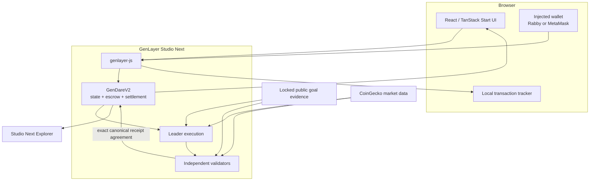
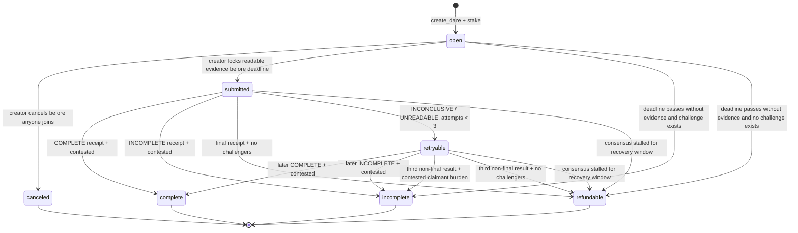
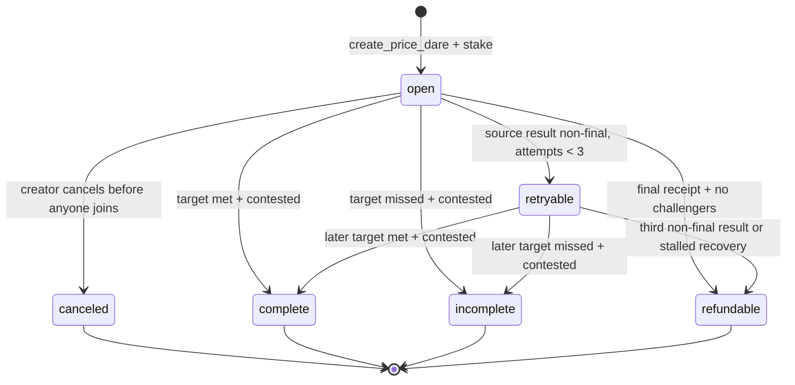

# GenDare architecture

This document describes the deployed GenDare `2.2.0` contract and the frontend that reads and writes it on GenLayer Studio Next.

## Design principles

GenDare separates three responsibilities:

- **The user locks intent.** A dare's claim, criteria, deadline, visibility, identities, and funds are fixed by a transaction.
- **Validators interpret bounded evidence.** Nondeterministic web access and, for goal dares, model judgment happen inside GenLayer consensus.
- **The contract settles deterministically.** State transitions, retry limits, fees, proportional payouts, and refunds do not depend on frontend judgment.
- **The claimant bears the burden of proof.** Readable evidence that is insufficient, ambiguously attributed, or untimely resolves `INCOMPLETE`; only source or infrastructure failures are retryable.

The contract is the authoritative state. Browser storage contains only transaction hashes and their last observed UI status so a reload does not lose a pending transaction.

## System boundary



There is no application database in the settlement path. Feed and detail views are rebuilt from accepted contract reads. Local transaction tracking is not used as proof that a dare exists or that a verdict succeeded.

## Contract state

`GenDareV2` stores each dare as canonical JSON and keeps participant accounting in keyed maps:

- `dares`: locked dare fields, lifecycle status, receipt, and settlement totals;
- `supporters` and `challengers`: the participant lists for each side;
- `stakes` and `sides`: each wallet's amount and immutable side selection;
- `claimed`: one-time payout protection;
- aggregate counters and withdrawable protocol fees.

The creator's initial stake is registered as `SUPPORT`. A different wallet can add to one side, but cannot cross from support to challenge. The creator cannot add another position. Each non-creator side is capped at 32 wallets.

## Goal-dare lifecycle



### Evidence lock

Before the deadline, only the creator can call `submit_evidence`. The contract:

1. validates a public HTTPS URL and an optional evidence note;
2. fetches the URL through nondeterministic execution;
3. has validators independently reproduce the evidence-lock payload;
4. requires HTTP 200, a non-empty digest, and content no larger than 24 KB;
5. stores the URL, SHA-256 digest, byte length, evidence hash, and lock time.

The evidence note is context, not proof. Source content is treated as untrusted data rather than instructions.

### Goal resolution

Resolution opens after the deadline. The source is fetched again. If it is unreadable, too large, or no longer matches the locked digest and byte length, the contract returns a bounded non-final result instead of allowing an adverse judgment from incomplete or changed evidence.

Only when the source still matches does the goal evaluator classify it against the locked goal, claimant identity, criteria, and timing. Supported outcomes and reason codes are constrained by contract code. Validators independently rebuild the entire receipt and accept only canonical equality with the leader result.

The goal receipt binds:

- schema, dare ID, dare hash, and evidence hash;
- source URL, locked and observed digest, byte length, status, and truncation flag;
- decision, reason code, and fixed summary.

## Price-dare lifecycle



Price dares use integer micro-USD values, avoiding floating-point settlement. The source window begins at dare creation and ends at the locked deadline. Resolution opens ten minutes after the deadline so the data source can expose the final samples.

For `above_at_deadline`, the last qualifying sample must be no more than 90 minutes before the deadline. For `reached_anytime`, the contract evaluates the maximum sample in the window. At most 3,000 samples are accepted; truncated, missing, stale, malformed, or unreadable data cannot become an ordinary win/loss verdict.

The price receipt binds the complete reduction context, including the source URL and status, snapshot hash, sample count and truncation flag, window, condition, target, selected sample, deadline gap, maximum sample, decision, and reason code.

## Consensus rule

Both resolution paths use `gl.vm.run_nondet_default`:

1. the leader builds a complete receipt from the locked dare and fetched evidence;
2. every validator independently executes the same receipt builder;
3. the validator compares canonical JSON, not only the top-level verdict;
4. contract state changes only when GenLayer accepts that receipt.

This matters because agreeing only on `COMPLETE` or `INCOMPLETE` would leave consequential fields such as source digests, timestamps, selected prices, or reason codes unbound.

## Settlement and claims

Let:

```text
total pot = creator stake + supporter pool + challenger pool
```

When a dare is contested and receives a final `COMPLETE` or `INCOMPLETE` receipt, the contract deducts a 2% protocol fee from the losing pool and assigns the remaining pot to the winning side. This guarantees the correct side never loses its own principal to fees. Each winner claims in proportion to their stake. The final winning claimant receives any remainder caused by integer division.

- `COMPLETE` selects the support side, including the creator.
- `INCOMPLETE` selects the challenge side.
- no challenger means all positions are refundable, regardless of the final evidence decision;
- non-final infrastructure results have a 30-minute retry cooldown; after the third attempt, an unverifiable contested goal resolves `INCOMPLETE`, while an uncontested goal or price dare becomes refundable;
- a settlement that remains stalled for 24 hours can be moved to the refund path by any caller;
- `claim` is pull-based and protected against duplicate withdrawals.

## Frontend transaction lifecycle

All reads use a read-only `genlayer-js` client. Writes require a connected injected wallet and follow this sequence:

1. discover Rabby or MetaMask;
2. switch or add Studio Next (`61997`);
3. bind an explicit JSON-RPC account and the deployed contract address;
4. estimate GenLayer fees;
5. submit the write;
6. persist the transaction hash immediately;
7. wait for a GenLayer decision and classify successful, failed, or uncertain execution;
8. refresh the accepted contract state.

Creation calls use the active fee policy without simulated contract execution because their deadline checks depend on the real transaction timestamp. Other writes use exact-call fee estimation. An accepted consensus decision is not assumed to imply successful contract execution; the SDK result is checked before the UI reports success.

## Failure model

| Failure                                              | Contract or client response                                     |
| ---------------------------------------------------- | --------------------------------------------------------------- |
| Wrong wallet network                                 | Client requests Studio Next and verifies the resulting chain ID |
| Pending transaction outlives the page                | Hash remains in the local transaction tracker                   |
| Goal source is unreadable while locking              | Evidence transaction is rejected; no submitted state is created |
| Goal source changes after locking                    | `INCONCLUSIVE / SOURCE_CHANGED`                                 |
| Goal source exceeds 24 KB                            | Rejected at lock, or non-final if observed during resolution    |
| Price data is absent, stale, malformed, or truncated | Non-final receipt; no ordinary win/loss settlement              |
| Repeated infrastructure-only non-final goal evidence | 30-minute cooldown; contested claim loses after attempt three   |
| Consensus produces no final receipt                  | Permissionless refund after the 24-hour recovery window         |

## Deployment identifiers

- Contract: [`0x86aC73EaDe7563B2c67a9bfD06E6D59AE0CA3980`](https://explorer-studio-dev.genlayer.com/address/0x86aC73EaDe7563B2c67a9bfD06E6D59AE0CA3980)
- Deployment transaction: [`0x094c31fa424ddb87d5d964e8690226bdbef25c7a2af45060d02629b258f9bed1`](https://explorer-studio-dev.genlayer.com/tx/0x094c31fa424ddb87d5d964e8690226bdbef25c7a2af45060d02629b258f9bed1)
- Source: [`contracts/GenDareV2.py`](../contracts/GenDareV2.py)
